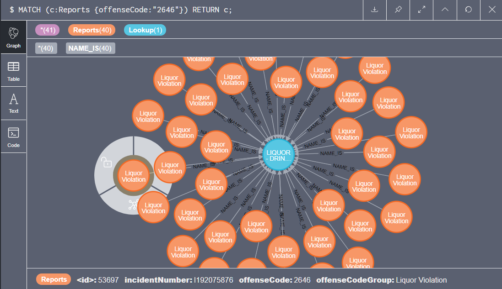
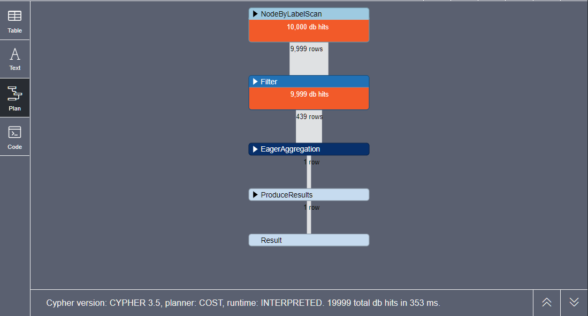
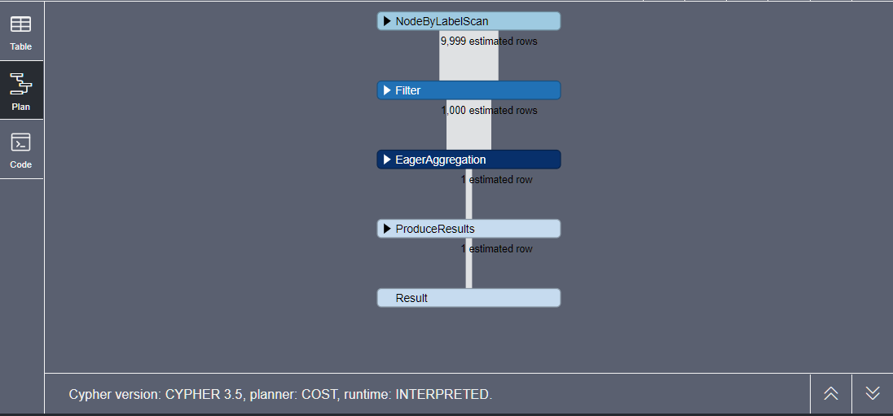
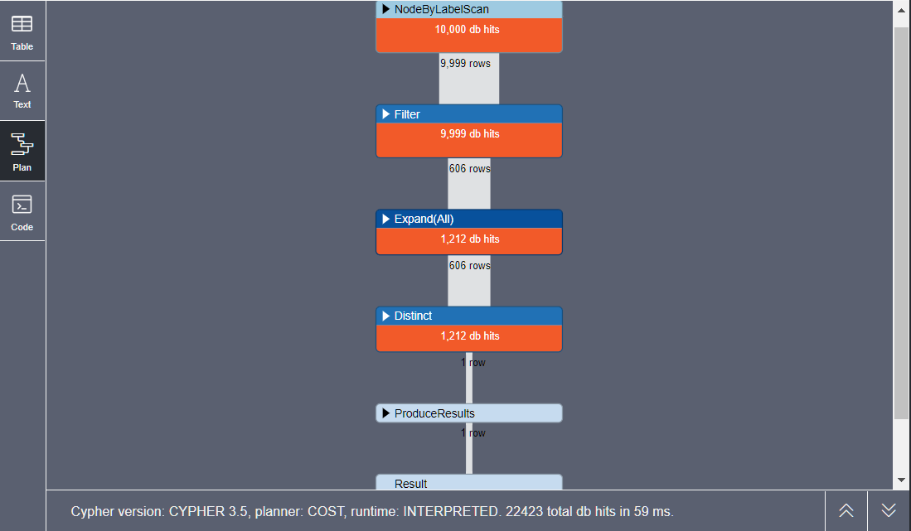
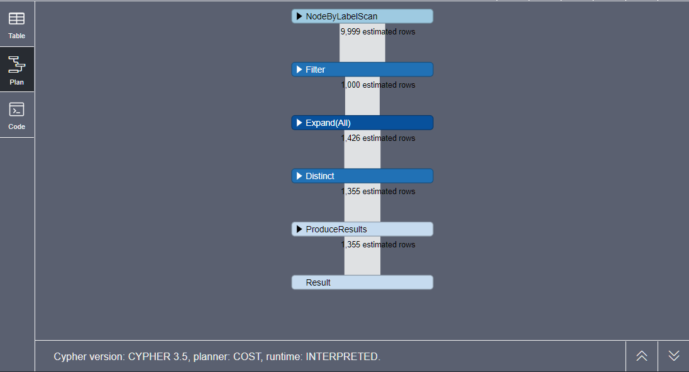
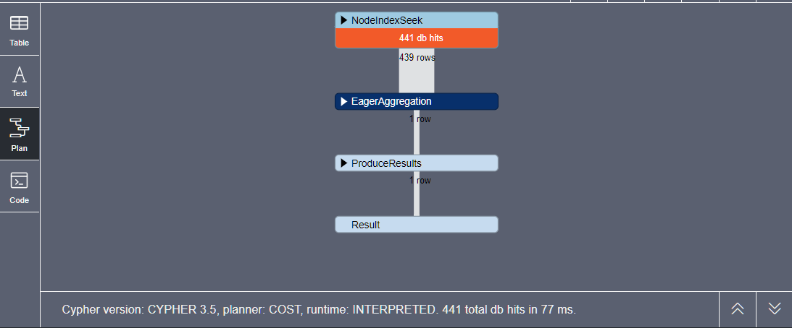
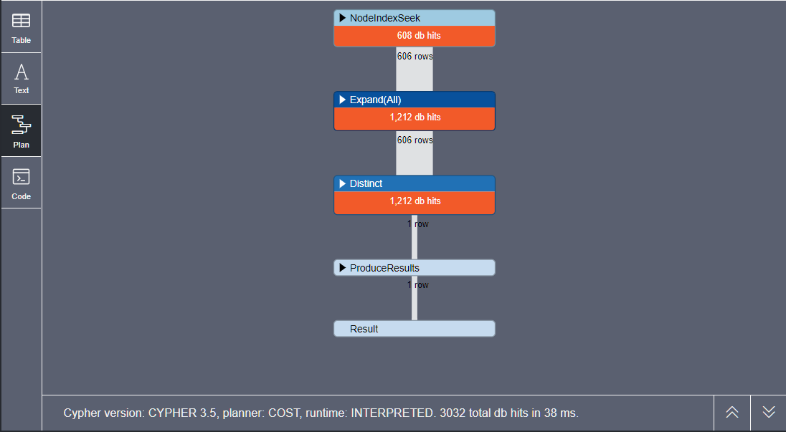
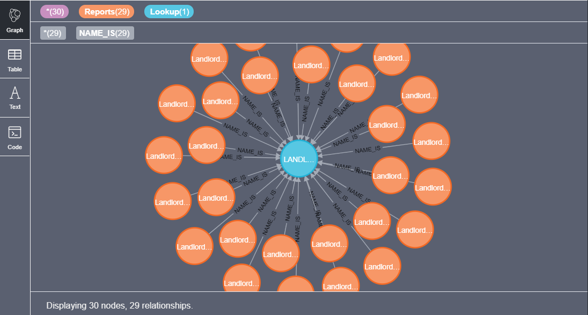
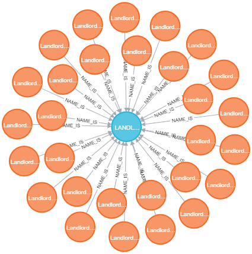

# Big Data Architecture Lab 3
### ZHANG Xin
## Table of contents
  - [Task 1: data import](#task-1-data-import)
    - [1. import the files](#1-import-the-files)
    - [2. Model data as a property graph](#2-model-data-as-a-property-graph)
  - [Task 2: data querying and analysis](#task-2-data-querying-and-analysis)
    - [1. Find the number of incidents by `Drug Violation` offense group.](#1-find-the-number-of-incidents-by-drug-violation-offense-group)
    - [2. Find the names of offense codes for incidents of `Investigate Person` offense group.](#2-find-the-names-of-offense-codes-for-incidents-of-investigate-person-offense-group)
    - [3. `PROFILE` and `EXPLAIN` two above queries.](#3-profile-and-explain-two-above-queries)
    - [4. Add indexes on your graph. What are the changes in the plans?](#4-add-indexes-on-your-graph-what-are-the-changes-in-the-plans)
    - [5. Explore a graph, and write a query of your choice using ORDER BY clause.](#5-explore-a-graph-and-write-a-query-of-your-choice-using-order-by-clause)
      - [Explore a graph](#explore-a-graph)
      - [A query using `ORDER BY` clause.](#a-query-using-order-by-clause)
  - [Task 3: results visualization](#task-3-results-visualization)
## Task 1: data import
### 1. import the files
Command:
```sql
LOAD CSV WITH HEADERS FROM "file:///boston-crime-incident-reports-10k.csv" AS row
CREATE (reports:Reports {incidentNumber: row.INCIDENT_NUMBER, offenseCode: row.OFFENSE_CODE, offenseCodeGroup: row.OFFENSE_CODE_GROUP});
```
Result:
```
Added 9999 labels, created 9999 nodes, set 29997 properties, completed after 649 ms.
```
Commande:
```sql
LOAD CSV WITH HEADERS FROM "file:///boston-offense-codes-lookup.csv" AS row
MERGE (lookup:Lookup {code: row.CODE, name: row.NAME});
```
Result:
```
Added 576 labels, created 576 nodes, set 1152 properties, completed after 72 ms.
```
### 2. Model data as a property graph
Create the incident number to name relation
```sql
LOAD CSV WITH HEADERS FROM "file:///boston-offense-codes-lookup.csv" AS row
MATCH (code:Reports {offenseCode: row.CODE})
MATCH (name:Lookup {name: row.NAME})
MERGE (code)-[ni:NAME_IS]->(name);
```
A sample graph is shown below.



**Comments:** As the main table (file:///boston-crime-incident-reports-10k.csv) is obviously not in the [third normal form](https://en.wikipedia.org/wiki/Third_normal_form), a property graph as shown in the example is not achievable by simply decalring the relations. The only realtion we can build now is the incident number to name relation.

## Task 2: data querying and analysis
### 1. Find the number of incidents by `Drug Violation` offense group.
```sql
MATCH (dv:Reports {offenseCodeGroup: 'Drug Violation'})
RETURN COUNT(dv) as count;
```
```
╒═══════╕
│"count"│
╞═══════╡
│439    │
└───────┘
```
### 2. Find the names of offense codes for incidents of `Investigate Person` offense group.
```sql
MATCH (dv:Reports {offenseCodeGroup: 'Investigate Person'})-[ni:NAME_IS]->(nm)
return DISTINCT dv.offenseCode, nm.name;
```
result
```
╒════════════════╤════════════════════╕
│"dv.offenseCode"│"nm.name"           │
╞════════════════╪════════════════════╡
│"3115"          │"INVESTIGATE PERSON"│
└────────────────┴────────────────────┘
```
### 3. `PROFILE` and `EXPLAIN` two above queries.
```sql
PROFILE MATCH (dv:Reports {offenseCodeGroup: 'Drug Violation'})
RETURN COUNT(dv) as count;
```

```sql
EXPLAIN MATCH (dv:Reports {offenseCodeGroup: 'Drug Violation'})
RETURN COUNT(dv) as count;
```

```sql
PROFILE MATCH (dv:Reports {offenseCodeGroup: 'Investigate Person'})-[ni:NAME_IS]->(nm)
return DISTINCT dv.offenseCode, nm.name;
```

```sql
EXPLAIN MATCH (dv:Reports {offenseCodeGroup: 'Investigate Person'})-[ni:NAME_IS]->(nm)
return DISTINCT dv.offenseCode, nm.name;
```

### 4. Add indexes on your graph. What are the changes in the plans?
```sql
CREATE INDEX ON :Reports(offenseCodeGroup);
Added 1 index, completed after 217 ms.
CREATE INDEX ON :Reports(offenseCode);
Added 1 index, completed after 4 ms.
CREATE INDEX ON :Lookup(name);
Added 1 index, completed after 4 ms.
```
So we redo `PROFILE` for the two queries.
```sql
PROFILE MATCH (dv:Reports {offenseCodeGroup: 'Drug Violation'})
RETURN COUNT(dv) as count;
```

```sql
PROFILE MATCH (dv:Reports {offenseCodeGroup: 'Investigate Person'})-[ni:NAME_IS]->(nm)
return DISTINCT dv.offenseCode, nm.name;
```


From above, we can easily see that after having added indexs, the `Filter` step is no longer needed, and the lookup is much quicker now.

### 5. Explore a graph, and write a query of your choice using ORDER BY clause.
#### Explore a graph
```sql
MATCH path = (b:Reports)-[ni:NAME_IS]->(nm)
WHERE b.offenseCode = "3112"
RETURN path;
```

#### A query using `ORDER BY` clause.
```sql
MATCH(tp:Reports)-[ni:NAME_IS]->(nm)
RETURN DISTINCT tp.offenseCode, nm.name, COUNT(*) AS count
ORDER BY count DESC
LIMIT 10;
```
result
```
╒════════════════╤═══════════════════════════════════════╤═══════╕
│"tp.offenseCode"│"nm.name"                              │"count"│
╞════════════════╪═══════════════════════════════════════╪═══════╡
│"3831"          │"M/V - LEAVING SCENE - PROPERTY DAMAGE"│1002   │
├────────────────┼───────────────────────────────────────┼───────┤
│"3006"          │"SICK/INJURED/MEDICAL - PERSON"        │712    │
├────────────────┼───────────────────────────────────────┼───────┤
│"3115"          │"INVESTIGATE PERSON"                   │606    │
├────────────────┼───────────────────────────────────────┼───────┤
│"802"           │"ASSAULT SIMPLE - BATTERY"             │496    │
├────────────────┼───────────────────────────────────────┼───────┤
│"802"           │"ASSAULT & BATTERY"                    │496    │
├────────────────┼───────────────────────────────────────┼───────┤
│"1402"          │"VANDALISM"                            │465    │
├────────────────┼───────────────────────────────────────┼───────┤
│"3301"          │"VERBAL DISPUTE"                       │421    │
├────────────────┼───────────────────────────────────────┼───────┤
│"3410"          │"TOWED MOTOR VEHICLE"                  │379    │
├────────────────┼───────────────────────────────────────┼───────┤
│"3114"          │"INVESTIGATE PROPERTY"                 │372    │
├────────────────┼───────────────────────────────────────┼───────┤
│"3201"          │"PROPERTY - LOST"                      │321    │
└────────────────┴───────────────────────────────────────┴───────┘
```
## Task 3: results visualization
the result PNG file (`graph.png`) is shown below


**Conclusions**
The graph built from `CSV` tables will not have a great readability unless all tables imported are already in the [third normal form](https://en.wikipedia.org/wiki/Third_normal_form). Likewisely, we need to form the nodes into the [third normal form](https://en.wikipedia.org/wiki/Third_normal_form) in order to build highly readable graphs.